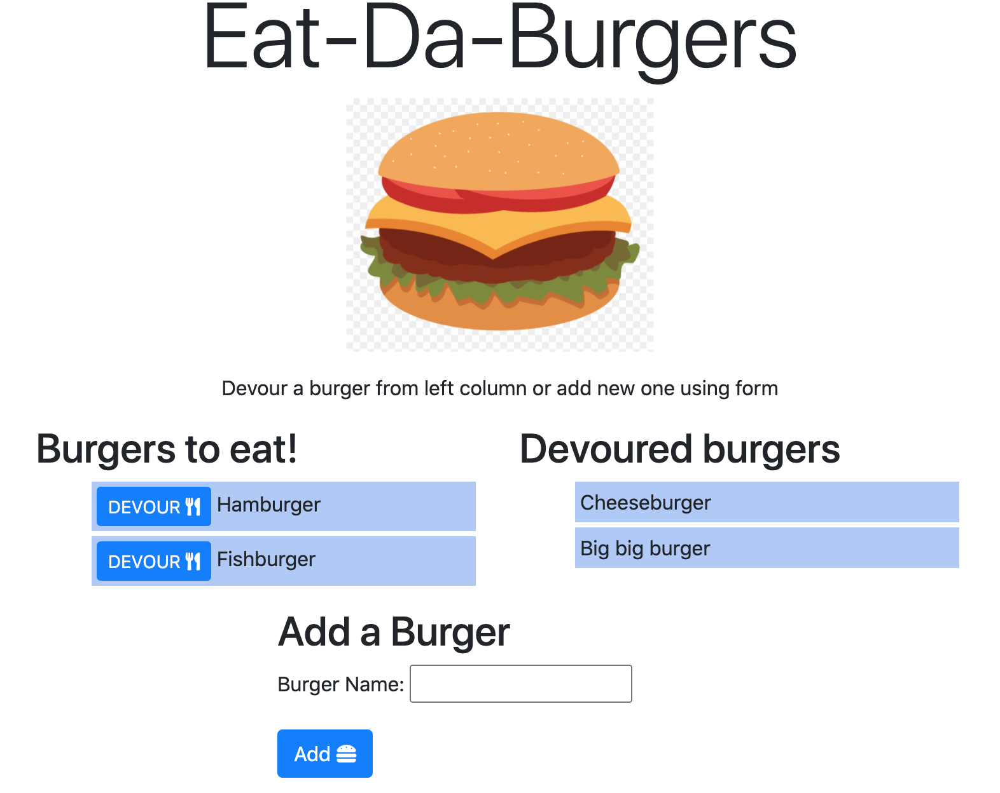

# eat-da-burger 
  Web app that works with burgers database.
  # Table of Contents
  1. [Installation](#installation)
  2. [Usage](#usage)
  3. [Detailed description](#detailed-description)
  4. [Files](#files)
  5. [License](#license)
  6. [Contribution Guidelines](#contribution-guidelines)
  7. [Questions](#questions)
## Installation
To install please use: 
`npm install`
## Usage
To use locally do next: 
- Create mysql database using `schema.sql`
- Create `.env` with login information to connect to database (`DB_USER`, `DB_PASS`)
- Start server `node server.js`
- open localhost:3000
## Deatiled description
Application deployed at [heroku](https://gentle-cove-02312.herokuapp.com/)

For database it uses MySQL (in deployed version it's JawsDB MySQL add-on for Heroku).

Apllication allows to add new burgers to database and to move burgers from uneaten state to devoured state.

## Files
- `config/connection.js` - code to connect to Database
- `config/orm.js` - code to qury database
 
- `controllers/burgers_controller.js` - express routes
- `db` - contains SQL queries to create Database
- `models/burger.js` - contains `burger` class, with methods that allow Select all burgers, Insert and Update one.
- `package.json` - info about project dependencies 
- `public/assets/css/style.css` - style file for html page.
- `public/assets/img/burger.png` - image of burger.
- `public/assets/js/burgers.js` - Javascript file for frontend part, Uses Jquery
- `server.js` - runs server
- `views` - contains Handlebars files to show website

## License
[License: MIT](https://opensource.org/licenses/MIT)
## Contribution Guidelines 
Ask me

## Questions
For questionts please contact [me](https://github.com/Myau5x) at ola.illari@gmail.com
 

